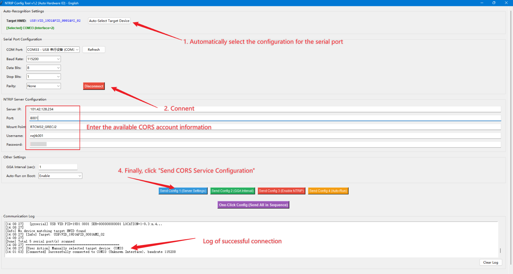
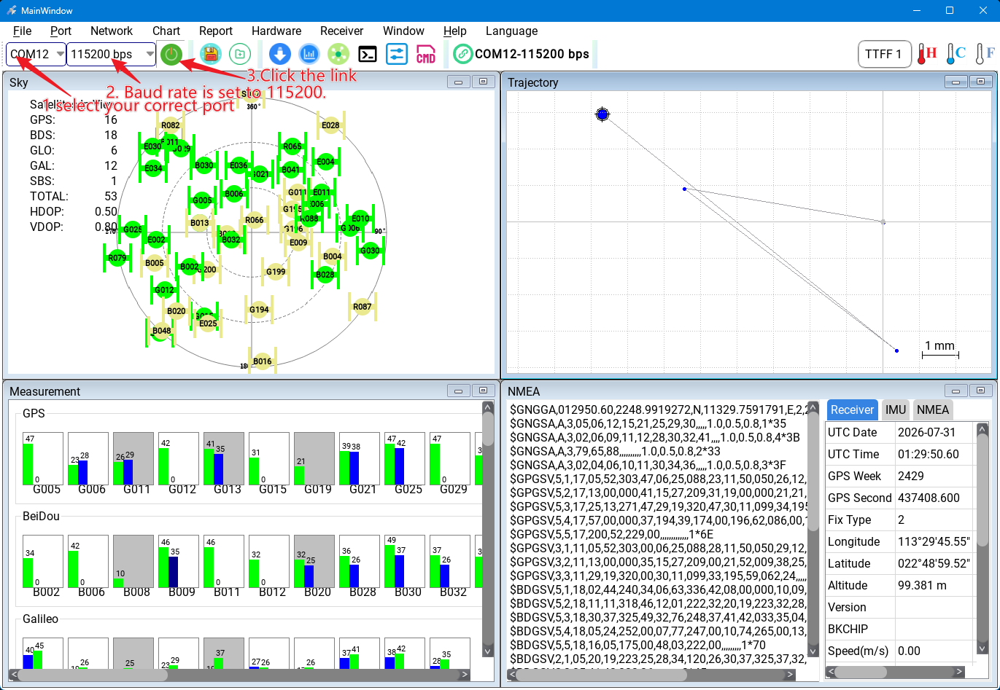

# D20快速开始

D20 是一体化双频 RTK 移动站，负责接收 GNSS 卫星信号和差分数据，在设备内部完成 RTK 解算，并通过串口向飞控、机器人主控、Viobot2 或 PC 输出定位结果。

D20 按差分链路分为 4G 版本和 LoRa 版本。4G 版本通过 CORS/NTRIP 服务获取差分数据；LoRa 版本通常配套 D13 基站使用，通过本地 LoRa 链路获取差分数据。

本节说明 D20 首次使用时的硬件准备、差分配置、线缆连接和上位机状态查看流程。完成本节操作后，可在确认设备正常输出定位数据的基础上，再接入飞控、机器人主控、Viobot2 或其他实际应用场景。

## 主要参数

| 项目       | 参数                                                                       |
| -------- | ------------------------------------------------------------------------ |
| 产品形态     | 四臂螺旋天线 RTK 一体化定位模组                                                       |
| 卫星系统     | GPS、北斗、GLONASS、Galileo、QZSS、IRNSS，支持 SBAS                                |
| 频点       | GPS L1/L5、北斗 B1/B2A/B2I/B1C、Galileo E1/E5、QZSS L1/L5、GLONASS G1、IRNSS L5 |
| RTK 定位精度 | 水平 0.01 m + 1 ppm，垂直 0.015 m + 1 ppm                                     |
| 速度精度     | 0.05 m/s                                                                 |
| 数据更新率    | PVT/RAW 最高 20 Hz，RTK 最高 10 Hz                                            |
| 通讯接口     | TTL 电平 UART，默认波特率 115200 bps                                             |
| 支持协议     | NMEA 0183、NAV-PVT、RTCM3                                                  |
| 供电       | DC 4.6-5.5 V，典型 5 V                                                      |
| 典型电流     | ----------                                                               |
| 尺寸与重量    | ----------                                                               |
| 工作温度     | -40°C 到 +85°C                                                            |

## 硬件准备

**通用配件**

- D20 主机。
- 8Pin GH1.25 线缆。
- 稳定 5V 电源。
- USB 转 TTL 模块，或目标设备 UART 串口。
- PC 端 NavStarTool 上位机。

**4G版本额外准备**

- SIM 卡。
- CORS/NTRIP 账号信息，包括服务器地址、端口、挂载点、账号和密码。
- JR_NTRIP_Config_Tool软件。
- 可传输数据的 USB Type-C 线。
- 安装好附带的SMA接口的外部4G天线

**LoRa版本额外准备**

- 架设基站的支架。
- 持续稳定的5V电源，推荐先使用充电宝进行供电。
- D13 LoRa 基站。
- 安装好附带的SMA接口的外部Lora天线

## 配置差分&基站架设

### 4G版本配置差分账号

D20 4G版本需要通过底部的Type\-C接口设置Cors账号，具体操作需要准备一根具有数据传输功能的Type\-C数据线一端连接到电脑上，另一端Type\-C接口连接D20底部的Type\-C接口上；打开JR\_NTRIP\_Config\_Tool\_V1\.2软件，点击"自动选择（Auto\-Select Target Device）"的按钮，然后软件会自动根据设备ID号选中一个配置端口，再点击连接，然后底部的连接日志区域会显示连接成功的字样就代表连接成功了，之后就是填写NTRIP ServerConfiguration下的cors账号的配置；正确填写完毕之后点击按钮“发送配置1服务器配置（Send Config 1 \(Server Settings\)”之后连接日志区域会显示OK的字样就代表Cors账号设置成功了。

*D20 4G版 ntrip 账号配置*

### Lora版本架设基站

Lora版本D20不需要使用Cors账号来注入差分，它的差分是通过另一个D13蘑菇头Lora基站来提供的，所以使用前需要将基站进行离地1米左右的高度进行架设，并用5V电源进行供电。

> 注意：给基站供电之后不可中途移动基站，如果移动了基站则需要重新上电。

## 配合上位机使用

### 电源、通讯线缆连接

按照以下的图片的定义进行连接线缆，注意电源不能接反。

- D20 VCC 接稳定 5V 电源。
- D20 GND 接电源地，并与 USB 转 TTL 或目标设备共地。
- D20 TX 接 USB 转 TTL 或目标设备 RX。
- D20 RX 接 USB 转 TTL 或目标设备 TX。
- SCL、SDA是磁罗盘接口，只使用RTK时用不上，不接。

*D20连接usb转ttl*

### 上位机连接

> 地面版本使用 [NavStarTool](https://github.com/myrobotproject/RTK_Interface-Description/blob/main/NavStarTool_260703_cust_En.zip) 上位机软件
> 无人机版本固件推荐使用ublox 的ucenter软件

1. 打开 NavStarTool。
2. 选择 D20 对应的串口号。
3. 波特率默认选择 `115200`。
4. 点击连接。
5. 连接成功后查看卫星数、经纬高、定位状态和原始协议输出。

按照上面的图示连接好USB TO TTL模块之后连接到电脑上。对于Lora版本还需要按本节的基站架设的方法将基站的电源连接好，D20 4G版本还需要按照3\.2节的方式配置好Cors账号，然后打开 NavStarTool 软件，根据电脑上的端口选择连接D20的实际端口号，波特率选择115200然后点击连接按钮，连接成功后软件内的卫星信息、定位信息就会不断的被显示出来，可在软件右下角的窗口中查看NMEA的原始输出、解析出的经纬度信息、海拔信息、固定解状态、卫星数等。D20\-Lora版本首次上电需要等待1\~3分钟不等之后模组才可出固定解；D20 4G版首次上电到输出固定解算大约是45秒。

*NavStarTools连接设备*

## 下一步

- 需要接入Viobot2 或者地面小车时可以参考接入Viobo2的章节内容。
- 需要接入 AMP、PX4 或 Viobot2 时，阅读对应行业应用章节。
