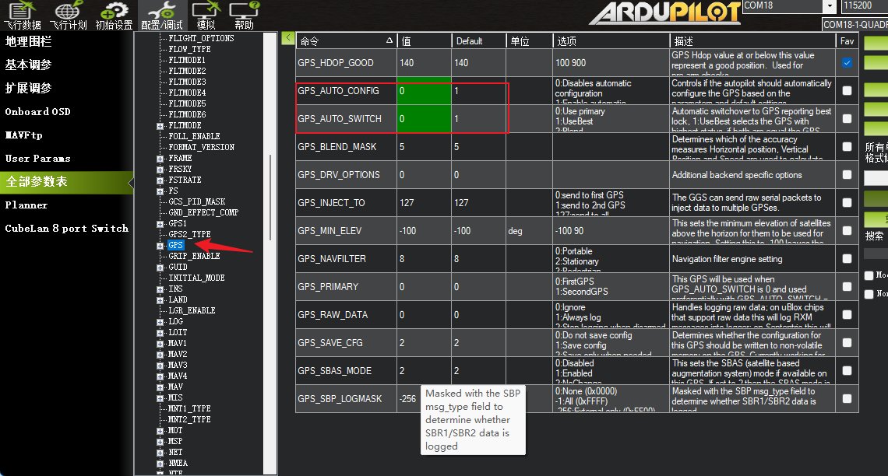
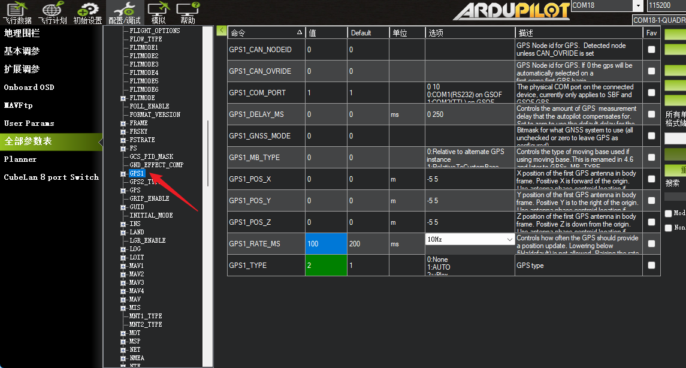

# 接入 ArduPilot

本页说明 D20 接入 ArduPilot 飞控的基本要求。APM 是历史上常见的硬件/项目称呼；本文统一使用当前软件项目名称 ArduPilot。

D20 应使用无人机版固件，默认输出 10 Hz UBX 定位数据。接入飞控前，先确认设备供电正常、定位数据持续输出，并在开阔环境验证 RTK 固定解。

固件选择见[固件与输出协议选择](../05-基本使用/固件与输出协议选择.md)，完整 8-pin 定义见[D20接口与接线](../05-基本使用/D20接口与接线.md)。

## 固件版本

| 项目 | 要求 |
| --- | --- |
| D20 固件 | 无人机版固件 |
| 主要输出协议 | 默认 10 Hz UBX |
| 差分链路 | 按现场条件选择 4G 版本或 LoRa 版本 |

## 硬件连接

:::{danger} 先核对D20 8-pin线束，再连接飞控电源
保持设备和飞控断电，并按[完整8-pin定义](../05-基本使用/D20接口与接线.md)逐线核对。D20只允许5 V ±0.5 V供电；禁止正负极反接，禁止使用错误电压，禁止把飞控电源正极接到D20 TX、RX或其他信号线，否则可能损坏设备。
:::

1. 将 D20 安装在无人机顶部、天空视野开阔的位置。
2. 将通信天线固定牢靠，避开桨叶、碳板、大电流线缆和强干扰源。
3. D20 TX 接飞控 GPS/UART RX，D20 RX 接飞控 GPS/UART TX。
4. D20 GND 与飞控 GND 共地。
5. D20 供电为 5 V ±0.5 V，UART IO 电平为 3.3 V。连接前确认飞控端口的供电能力和 UART 电平兼容。

若飞控提供有明确 Pin 定义的标准 6-pin GPS/UART 接口，可以使用配套的 D20 8-pin 转飞控 6-pin 转接线。连接前必须同时核对转接线两端 Pin 顺序、D20 8-pin 定义和飞控接口定义；接口外形匹配不代表线序一定匹配。

## 飞控侧配置

飞控侧应启用实际连接 D20 的 GPS/UART 端口，并按以下边界配置：

| 项目 | 要求 |
| --- | --- |
| 串口用途 | GPS |
| 波特率 | 115200 bps |
| 输入协议 | UBX |
| 定位更新率 | 默认 10 Hz |

不同飞控硬件、ArduPilot 版本和端口编号对应的参数名称可能不同，应以实际飞控文档和地面站界面为准。

## CUAV 7-Nano 配置示例

以下界面来自 CUAV 7-Nano、ArduCopter V4.7.0-dev 和 Mission Planner 1.3.83，仅用于说明一套具体接入方式。其他飞控或固件版本的串口编号、参数名称和可选值可能不同，配置前必须先核对对应版本的飞控文档。

### 接线示例

图中的彩色引导线只用于表示信号对应关系，不代表交付线束颜色。连接时仍须以 D20 8-pin Pin 顺序、转接线功能标签和飞控接口定义为准。

### 参数示例

本示例使用 CUAV 7-Nano 的主 GPS 接口，对应 `SERIAL3`。参数值应按实际端口和飞控版本核对：

| 参数 | 示例值 | 作用 |
| --- | --- | --- |
| `SERIAL3_PROTOCOL` | `5` | 将对应串口配置为 GPS |
| `SERIAL3_BAUD` | `115` | ArduPilot 参数值 `115` 对应 115200 bps |
| `GPS_AUTO_CONFIG` | `0` | 关闭飞控对 GPS 的自动配置 |
| `GPS_AUTO_SWITCH` | `0` | 单 GPS 场景固定使用主 GPS；多 GPS 场景按实际需求配置 |
| `GPS1_TYPE` | `2` | 将 GPS1 输入类型设置为 u-blox/UBX |
| `GPS1_RATE_MS` | `100` | 将 GPS1 更新周期设置为 100 ms，即 10 Hz |

## 验证

1. 上电后确认飞控和地面站能够识别 GPS。
2. 确认卫星数、经纬度、高程和速度持续更新。
3. 在开阔环境确认定位状态依次进入 RTK 浮点解和 RTK 固定解。
4. 解锁飞行前，确认定位状态稳定且数据无异常跳变。

若飞控无法识别 D20，先检查无人机版固件、115200 bps 波特率、3.3 V UART 电平兼容性和 TX/RX 接线。有定位输出但无法进入固定解时，按[RTK状态与固定解验证](../05-基本使用/RTK状态与Fixed验证.md)检查差分配置和现场条件。
