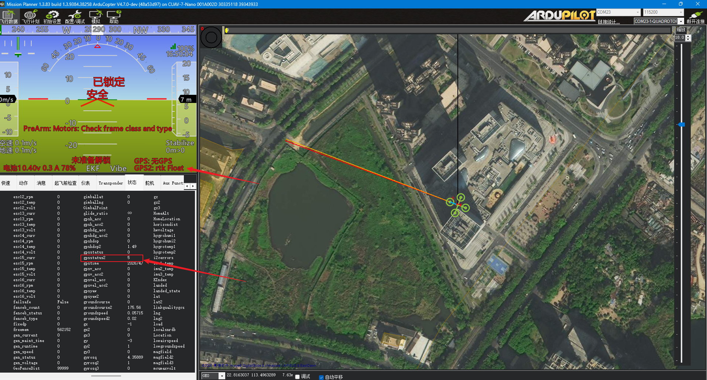

# D20接入ArduPilot飞控

## 概述

D20接入 ArduPilot 时，推荐使用无人机版固件。无人机版固件主要输出 `UBX/u-blox` 协议，适合飞控接收定位并通过地面站注入差分数据。

如果使用的是 NMEA 版固件，飞控只把它当普通 GPS 读取，不再展开差分注入流程。

本节将以CUAV 7-Nano ardupilot固件为例实操如何将D20接入飞控，实现无人机的高精度定位。

## 固件版本说明

| 固件版本 | 主要输出 | 适用方式 |
| --- | --- | --- |
| D20 无人机版固件 | `UBX/u-blox` | 飞控接入 RTK 的推荐方式 |
| D20 地面版固件 | `NMEA` | 仅作为普通 GPS 输入 |

## 硬件连接

- D20 `TX` 接飞控 GPS 口 `RX`
- D20 `RX` 接飞控 GPS 口 `TX`
- D20 `GND` 接飞控 `GND`
- Mission Planner 通过 Mavlink 连接飞控

## 飞控参数

### GPS 参数
按照官方文档7-Nano的主GPS接口在软件上对应的串口编号是`SERIAL3`，所以接入RTK之前先把`SERIAL3`先配置号

| 参数名 | 作用 | 值 |
| --- | --- | --- |
| `SERIAL3_PROTOCOL` | 设置 GPS1 口为GPS协议类型 | `5` |
| `SERIAL3_BAUD` | 设置 GPS1 口波特率为115200 | `115` |
| `GPS_AUTO_CONFIG` | 关闭飞控对 GPS 的自动配置 | `0` |
|`GPS_AUTO_SWITCH`| 自动选择主GPS，这里如果还有第二GPS源也可改为`1` `UseBest`| `0` |
|`GPS1_TYPE`| 设置GPS1的输入协议为ubx | `2` |
|`GPS1_RATE_MS`| 设置GPS1的频率为10hz | `100` |

## 定位效果

室内半边天环境下通常只能到浮点解；室外开阔环境下可以进入 `RTK Fixed`。

