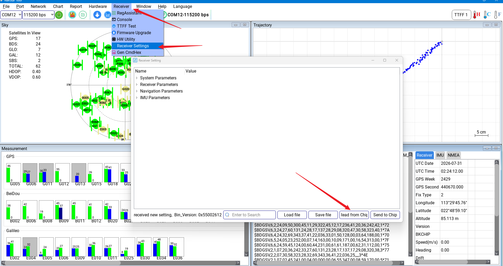
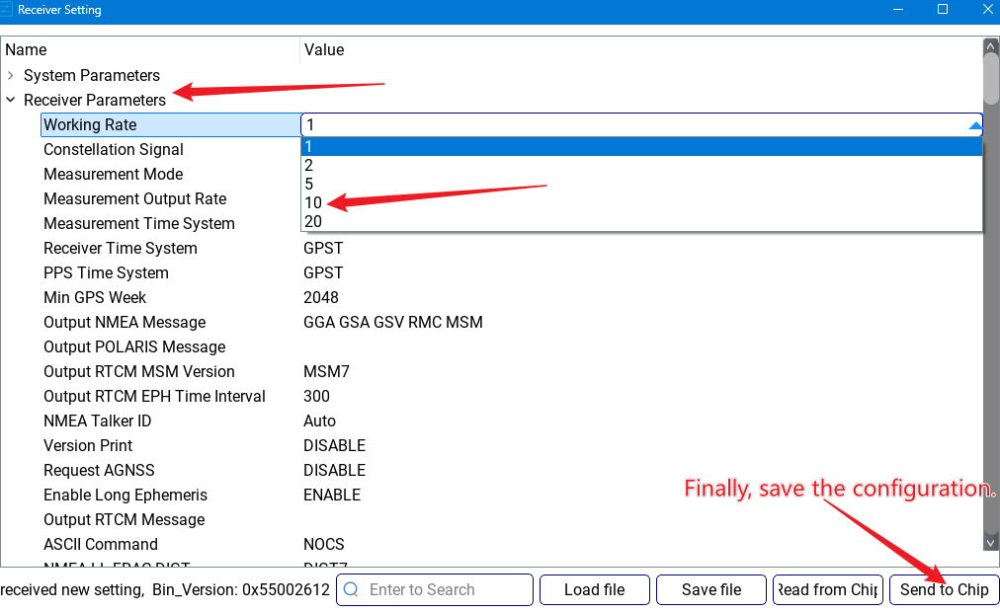
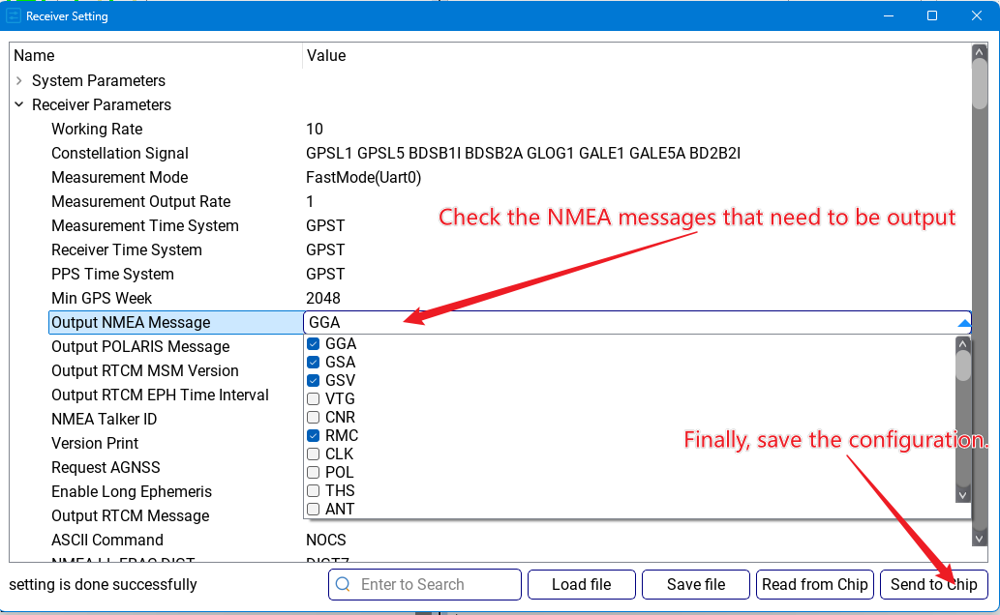

# 常用参数配置

:::{admonition} 本页范围
:class: page-summary

使用{ref}`NavStarTool <connect-navstartool>`调整**输出频率**和当前固件支持的 **NMEA / UBX 消息项**。完整功能可通过菜单栏 `Help` 查看官方使用说明。
:::

:::{important} 修改前先记录当前配置
先确认目标平台和当前出厂输出，并使用 `Read from Chip` 读取现有参数。选择原则见[固件与输出协议选择](../05-基本使用/固件与输出协议选择.md)。
:::

## 读取接收机配置

点击菜单栏：

```text
Receiver -> Receiver Settings
```

首次打开 `Receiver Settings` 窗口时，可能不会显示当前配置。此时需要点击界面中的 `Read from Chip`，从设备读取现有参数。



## 设置输出频率

以设置 NMEA 输出频率为 10 Hz 为例：

1. 在 `Receiver Settings` 中点击 `Read from Chip`。
2. 找到 `Receiver Parameters -> Working Rate`。
3. 下拉选择 `10`。
4. 点击 `Send to Chip` 保存配置。
5. 等待设备自动重启。



## 配置当前固件的输出消息

D20 地面版默认 10 Hz NMEA，无人机版默认 10 Hz UBX；D13 仅提供地面版，默认输出 10 Hz NMEA，可按需求配置为 UBX。本页操作用于调整当前固件支持的消息项，不更改固件的用途配置。

如果外部设备只需要标准 NMEA，可在消息列表中只保留目标系统需要的语句。接入 Viobot2 时建议至少开启 GGA 和 RMC。

配置路径：

```text
Receiver Parameters -> Output NMEA Message
```

在可输出的 NMEA 消息列表中勾选需要发送的语句，然后点击 `Send to Chip` 保存。



:::{admonition} 配置完成判据
:class: success-check

设备重启后持续输出目标协议，实际刷新率和消息项与配置一致，下游设备能够正常解析。
:::

## 配置建议

| 场景 | 建议 |
| --- | --- |
| PC 调试 | 先保留当前固件的常用协议输出，便于观察状态 |
| D20 飞控接入 | 按飞控要求配置 UBX 输出；D20 无人机版默认 10 Hz |
| Viobot2 接入 | 至少开启 GGA 和 RMC；地面版默认 10 Hz，RTK 最高 10 Hz |
| 日志排查 | 保留原始协议日志，记录固件版本、串口参数和输出频率 |
