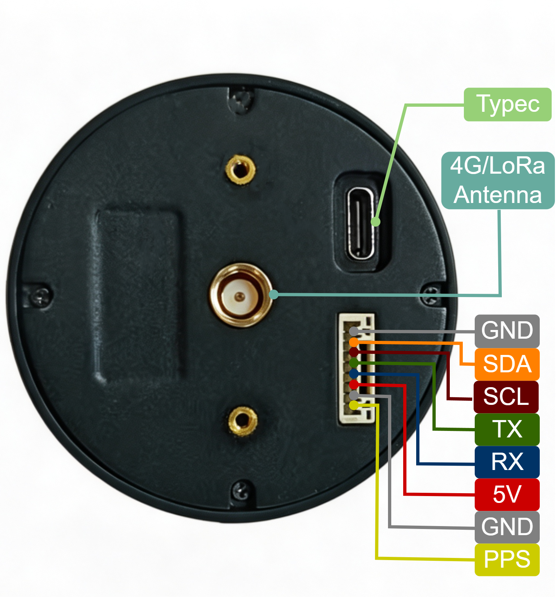

# D20系列介绍

D20 系列是一体化双频 RTK 定位终端，集成四臂螺旋 GNSS 天线、高精度 GNSS 定位模组、地磁罗盘传感器、通信模组和电源管理单元。设备支持 GPS、北斗、GLONASS、Galileo 等主流卫星导航系统，在具备差分数据和良好天空视野的条件下，可输出厘米级 RTK 定位结果。

D20 通过底部 8Pin GH1.25 接口完成供电和串口数据输出，可接入无人机飞控、机器人主控、Viobot2 或 PC 上位机。根据差分数据传输方式，D20 分为 4G 版本和 LoRa 版本；根据下游设备协议，固件分为无人机版和地面版。

## 4G版本

D20 4G 版本通过蜂窝网络连接 CORS/NTRIP 服务，由内置 4G 模块接收差分数据并参与 RTK 解算。设备侧需要安装已开通数据流量的 SIM 卡，并提前写入 CORS/NTRIP 账号信息。

4G 版本适合有蜂窝网络覆盖、作业范围较大、需要跨区域移动的场景，例如无人机测绘、移动机器人、手持采集终端和资产定位。

典型链路如下：

1. GNSS 天线接收卫星信号。
2. 4G 模块通过公网连接 CORS/NTRIP 服务。
3. 定位模组使用差分数据进行 RTK 解算。
4. D20 通过串口向下游设备输出定位数据。

## LoRa版本

D20 LoRa 版本通常配套 D13 基站使用，通过本地 LoRa 链路向移动站发送差分数据，不依赖公网。D13 基站应架设在开阔、稳定的位置，上电后保持静止；移动站接收 LoRa 差分数据后完成 RTK 解算。

LoRa 版本适合无公网覆盖、作业区域相对固定、需要自建差分链路的场景，例如园区机器人、农机、低空无人机和临时测量作业。

典型链路如下：

1. 基站接收卫星信号并生成差分数据。
2. 基站通过 LoRa 链路向 D20 移动站发送差分数据。
3. D20 移动站完成 RTK 解算。
4. D20 通过串口向下游设备输出定位数据。

## 版本选型

选型时需要同时确认差分链路版本和固件版本。4G/LoRa 决定差分数据如何传输；无人机版/地面版决定 D20 向下游设备输出的协议类型。

| 版本组合 | 差分数据传输方式 | 主要输出协议 | 适用场景 |
| --- | --- | --- | --- |
| 4G 无人机版固件 | 通过 4G 接入 CORS/NTRIP | UBX/u-blox 协议 | 有公网覆盖的无人机飞控接入，例如 AMP、PX4 |
| 4G 地面版固件 | 通过 4G 接入 CORS/NTRIP | NMEA 协议 | 有公网覆盖的地面机器人、Viobot2、PC 上位机接入 |
| LoRa 无人机版固件 | 通过 D13 基站发送差分数据 | UBX/u-blox 协议 | 无公网覆盖或自建基站的无人机飞控接入 |
| LoRa 地面版固件 | 通过 D13 基站发送差分数据 | NMEA 协议 | 无公网覆盖或自建基站的地面机器人、Viobot2 接入 |

无人机飞控一般选择无人机版固件，主要输出 UBX/u-blox 协议；地面机器人、Viobot2 和通用串口采集场景一般选择地面版固件，主要输出 NMEA 协议。LoRa 场景建议配套 D13 基站使用。
