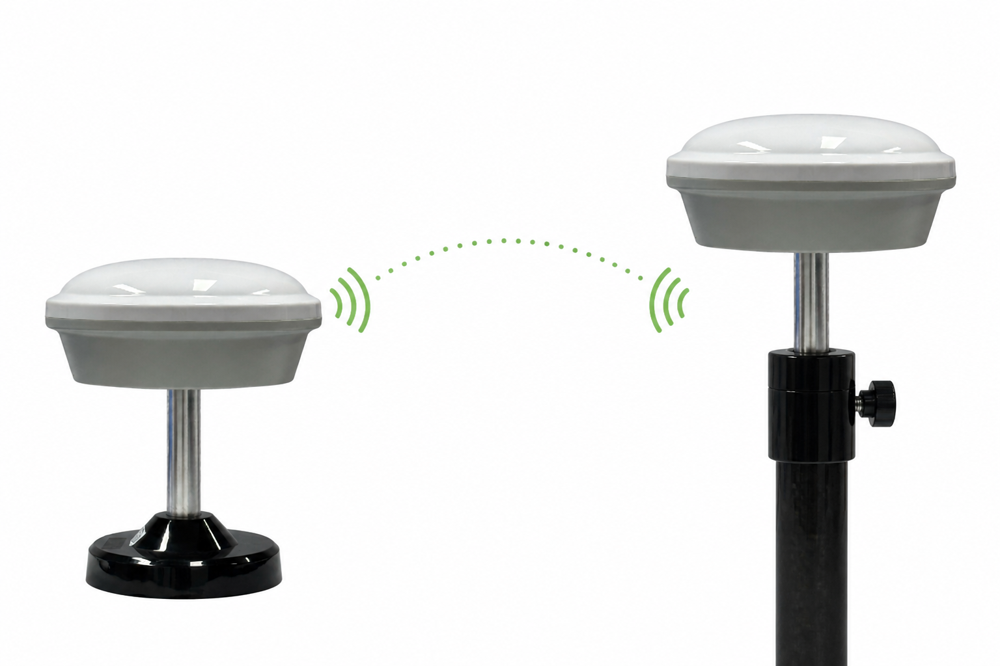

# HM-D13-LoRa

:::{admonition} 产品定位
:class: page-summary

**面向固定区域和无公网作业的双频 RTK 定位套件。** D13 LoRa 移动站采用紧凑型一体化设计，套件包含配套专用 D13 LoRa 基站硬件及附件。
:::

```{image} ../images/photos/d13-lora-kit.jpg
:alt: HM-D13-LoRa 移动站与配套 D13 LoRa 基站
:class: sku-product-image
```

## 核心价值

- **本地自建差分链路**：不依赖公网、流量卡或 CORS 账号。
- **出厂默认配对**：基站和移动站上电自动连接，减少现场通信配置。
- **适合稳定地面安装**：移动站集成 GNSS 天线、定位计算单元与 LoRa 通信链路，外部只需连接 5-pin GH1.25 mm 接口。
- **支持多移动站协同**：一个基站可一对一或一对多服务移动站。

## 工作方式



D13 基站固定接收卫星信号，通过内部 LoRa 链路向 D13 移动站发送差分数据；移动站完成 RTK 解算后，通过 5-pin GH1.25 mm 接口向外部设备输出定位结果。

## 交付组成

- HM-D13-LoRa 移动站。
- 配套专用 D13 LoRa 基站硬件。
- 移动站配套 5-pin 接口线缆和兼容 3.3 V UART I/O 的 USB 转 UART 转接器。
- 基站配套外置 LoRa 天线和封装好的 4-pin USB 线缆；安装配件以装箱清单为准。

:::{important} 套件边界
专用 D13 LoRa 基站硬件**仅随 LoRa 套件提供**，不单独销售，也不作为移动站使用。
:::

## 关键参数

| 项目 | 参数 |
| --- | --- |
| 定位类型 | L1/L5 双频 RTK |
| RTK 精度 | 水平 1.0 cm + 1 ppm；垂直 1.5 cm + 1 ppm |
| 启动 / RTK 首次固定 | 冷启动 28 s；热启动 1 s；RTK 首次固定 45 s |
| 输出协议 | NMEA 或 UBX；默认 10 Hz NMEA |
| RTK 最高更新率 | 10 Hz |
| 天线系统增益 | 40 dB |
| LoRa | 默认 915 MHz |
| 链路拓扑 | 单基站；一对一或一对多；最多 4096 个移动站 |
| 通信距离 | 最远约 6 km |
| 移动站接口 | 5-pin GH1.25 mm；UART/PPS I/O 3.3 V；默认 115200 bps |
| 供电 | 5 V ±0.5 V（4.5–5.5 V） |
| 工作电流 | 典型 80 mA |
| 尺寸 / 重量 | 移动站：Φ152 × 67.9 mm / 236 g；基站：Φ152 × 67.9 mm / 515 g |

完整 GNSS、环境和动态参数请查看[产品对比与资料](../comparison.md)。

## 外部接口

- **D13 移动站 5-pin GH1.25 mm**：供电、3.3 V UART 和 3.3 V PPS 信号，按固定 Pin 顺序连接。
- **D13 基站 USB 线缆**：对外仅使用封装好的 4-pin USB 线缆；连接 USB 电源可直接供电，连接电脑时可进行 USB 串口通信。
- **D13 基站通信天线接口**：连接基站外置 LoRa 天线。

## 适用场景与前提

适合测绘、精准农业、园区机器人、智能驾驶测试和固定区域多终端作业。

:::{important} LoRa 现场边界
基站应在开阔位置稳定架设，**上电后不得移动**；同一局部场景只使用一个基站。
:::

## 下一步

- [HM-D13-LoRa 首次使用](../../rtk/getting-started/hm-d13-lora.md)
- [LoRa 基站架设](../../rtk/differential-links/d13-base-station.md)
- [LoRa 移动站连接](../../rtk/differential-links/lora.md)
- [产品对比与资料](../comparison.md)
