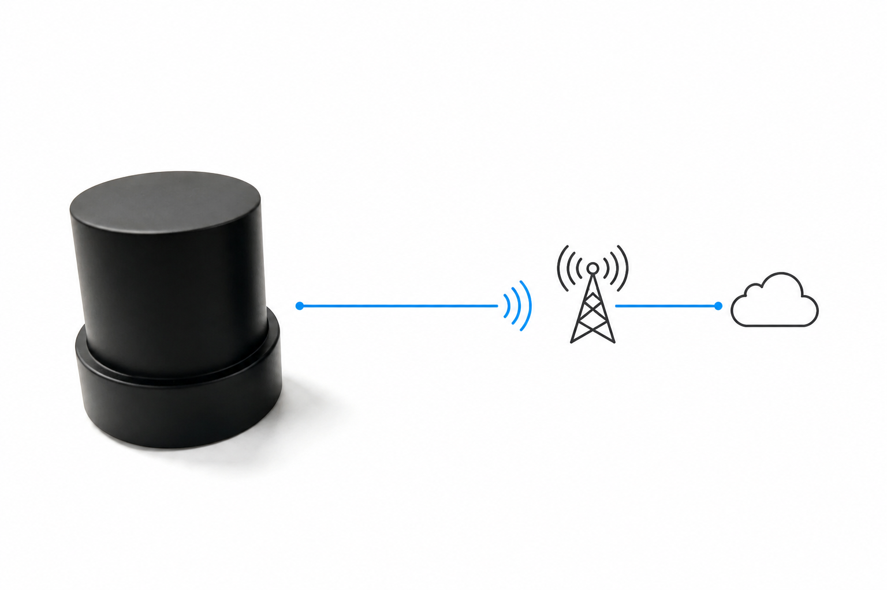

# HM-D20-4G

:::{admonition} 产品定位
:class: page-summary

**面向无人机和紧凑型移动平台的轻量化一体化 RTK 接收机。** 设备集成四臂螺旋天线、定位计算单元与 4G 通信链路，通过 CORS/NTRIP 获取差分数据并直接输出定位结果。
:::

```{image} ../images/photos/d20-product.jpg
:alt: HM-D20-4G 四臂螺旋天线一体化 RTK 接收机
:class: sku-product-image
```

## 核心价值

- **轻量紧凑**：整机 38.2 g，外形 Φ54.5 × 53 mm，降低无人机载荷和安装空间压力。
- **差分链路一体化**：通过 4G 接入 CORS/NTRIP，无需在作业区架设本地基站。
- **安装位置更灵活**：4G 天线采用外置 SMA 接口，可将天线布置到合适位置，减少与平台其他设备相互影响。
- **面向飞控集成**：8-pin 接口统一提供电源、UART 和磁力计信号，可按订单配置无人机或地面输出固件。

## 工作方式



设备接收 GNSS 卫星信号，同时通过 4G 网络获取 CORS/NTRIP 差分数据；完成 RTK 解算后，通过 8-pin 接口向飞控、机器人主控或 PC 输出 NMEA 或 UBX 数据。

## 交付组成

- HM-D20-4G 移动站。
- 8-pin 连接线缆、外置 4G 天线、USB-C 配置线和兼容 3.3 V UART I/O 的 USB 转 UART 转接器。

:::{important} 使用前提
用户需要自行准备**有流量的 Nano-SIM 卡、可用的 CORS/NTRIP 账号和蜂窝网络覆盖**。
:::

## 关键参数

| 项目 | 参数 |
| --- | --- |
| 定位类型 | L1/L5 双频 RTK |
| RTK 精度 | 水平 1.0 cm + 1 ppm；垂直 1.5 cm + 1 ppm |
| 启动 / RTK 首次固定 | 冷启动 28 s；热启动 1 s；RTK 首次固定 45 s |
| 输出协议 | NMEA 或 UBX；地面版默认 10 Hz NMEA，无人机版默认 10 Hz UBX |
| RTK 最高更新率 | 10 Hz |
| 天线系统增益 | 40 dB |
| 主接口 | 8-pin GH1.25 mm；UART/PPS I/O 3.3 V；默认 115200 bps |
| 供电 | 5 V ±0.5 V（4.5–5.5 V） |
| 工作电流 | 典型 120 mA |
| 尺寸 / 重量 | Φ54.5 × 53 mm / 38.2 g |
| 工作 / 存储温度 | -40–85 °C / -50–105 °C |

完整 GNSS 频点、灵敏度、动态条件和 LTE 频段请查看[产品对比与资料](../comparison.md)。

## 外部接口

```{figure} ../images/photos/d20-4g-interface.jpg
:alt: HM-D20-4G 底部接口实物图
:width: 72%
:align: center

HM-D20-4G 底部接口
```

- **8-pin GH1.25 mm**：供电、3.3 V UART、3.3 V PPS 和磁力计 SCL/SDA 信号。
- **SMA**：连接外置宽频 4G 天线。
- **USB-C**：使用标配配置线连接配置工具，写入 CORS/NTRIP 账号信息。

:::{danger} 8-pin 接线安全
接线前必须查看[完整 8-pin 线束定义](../../rtk/operation/d20-wiring.md)。设备只允许使用 5 V ±0.5 V 供电；正负极反接、使用错误电压或将电源正极接到 TX/RX 等信号线均可能损坏设备。
:::

## 适用场景与前提

适合无人机测绘、低空作业、移动机器人、车载设备和紧凑型定位终端。现场需要蜂窝网络覆盖；SIM 卡流量和 CORS/NTRIP 服务由用户管理。

## 下一步

- [HM-D20-4G 首次使用](../../rtk/getting-started/hm-d20-4g.md)
- [4G / CORS 配置](../../rtk/differential-links/4g-ntrip.md)
- [D20 接口与接线](../../rtk/operation/d20-wiring.md)
- [产品对比与资料](../comparison.md)
