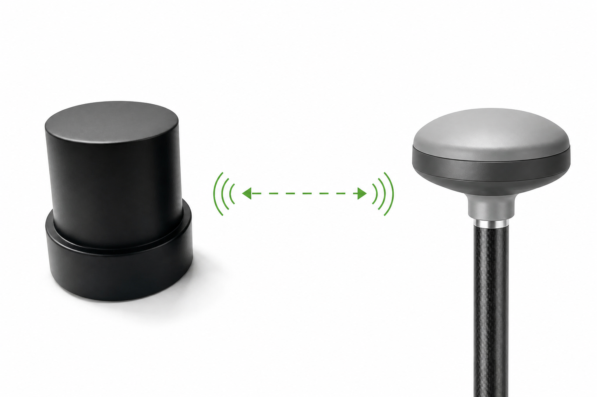

# HM-D20-LoRa

:::{admonition} 产品定位
:class: page-summary

**面向无公网或固定区域作业的轻量化 RTK 定位套件。** D20 LoRa 移动站集成四臂螺旋天线、定位计算单元与 LoRa 通信链路，并与配套 D13 LoRa 基站组成现场差分系统。
:::

```{image} ../images/photos/d20-product.jpg
:alt: HM-D20-LoRa 四臂螺旋天线一体化 RTK 移动站
:class: sku-product-image
```

## 核心价值

- **不依赖公网**：基站与移动站通过本地 LoRa 链路传输差分数据。
- **轻量移动端**：D20 移动站仅 38.2 g，适合无人机和紧凑型移动平台。
- **开箱完成配对**：基站和移动站出厂默认配对，上电自动连接。
- **支持多移动站**：一个局部场景使用一个基站，可一对一或一对多连接移动站。

## 工作方式



D13 基站固定接收卫星信号并通过内部 LoRa 链路发送差分数据，D20 移动站完成 RTK 解算，再通过 8-pin 接口向下游设备输出 NMEA 或 UBX 数据。

## 交付组成

- HM-D20-LoRa 移动站。
- 配套专用 D13 LoRa 基站硬件及基站附件。
- 移动站配套 8-pin 连接线缆、外置 LoRa 天线和兼容 3.3 V UART I/O 的 USB 转 UART 转接器。
- 基站配套外置 LoRa 天线和封装好的 4-pin USB 线缆；安装配件以装箱清单为准。


## 关键参数

| 项目 | 参数 |
| --- | --- |
| 定位类型 | L1/L5 双频 RTK |
| RTK 精度 | 水平 1.0 cm + 1 ppm；垂直 1.5 cm + 1 ppm |
| 启动 / RTK 首次固定 | 冷启动 28 s；热启动 1 s；RTK 首次固定 45 s |
| 输出协议 | NMEA 或 UBX；地面版默认 10 Hz NMEA，无人机版默认 10 Hz UBX |
| RTK 最高更新率 | 10 Hz |
| 天线系统增益 | 40 dB |
| LoRa | 默认 915 MHz |
| 链路拓扑 | 单基站；一对一或一对多；最多 4096 个移动站 |
| 通信距离 | 最远约 6 km |
| 主接口 | 8-pin GH1.25 mm；UART/PPS I/O 3.3 V；默认 115200 bps |
| 移动站供电 | 5 V ±0.5 V（4.5–5.5 V） |
| 工作电流 | 典型 80 mA |
| 移动站尺寸 / 重量 | Φ54.5 × 53 mm / 38.2 g |

完整 GNSS、环境和动态参数请查看[产品对比与资料](../comparison.md)。

## 外部接口

```{figure} ../images/photos/d20-lora-interface.jpg
:alt: HM-D20-LoRa 底部接口实物图
:width: 72%
:align: center

HM-D20-LoRa 底部接口
```

- **D20 移动站 8-pin GH1.25 mm**：供电、3.3 V UART、3.3 V PPS 和磁力计 SCL/SDA 信号。
- **D20 移动站 SMA**：连接外置 LoRa 天线。
- **D13 基站 USB 线缆**：对外仅使用封装好的 4-pin USB 线缆；连接 USB 电源可直接供电，连接电脑时可进行 USB 串口通信。
- **D13 基站通信天线接口**：连接基站外置 LoRa 天线。

:::{danger} 8-pin 接线安全
接线前必须查看[完整 8-pin 线束定义](../../rtk/operation/d20-wiring.md)。设备只允许使用 5 V ±0.5 V 供电；正负极反接、使用错误电压或将电源正极接到 TX/RX 等信号线均可能损坏设备。
:::

## 适用场景与前提

适合固定区域内的无人机、园区机器人、农机和临时测量作业。

:::{important} LoRa 现场边界
基站应在开阔位置稳定架设，**上电后不得移动**；同一局部场景只使用一个基站。
:::

## 下一步

- [HM-D20-LoRa 首次使用](../../rtk/getting-started/hm-d20-lora.md)
- [LoRa 基站架设](../../rtk/differential-links/d13-base-station.md)
- [LoRa 移动站连接](../../rtk/differential-links/lora.md)
- [产品对比与资料](../comparison.md)
