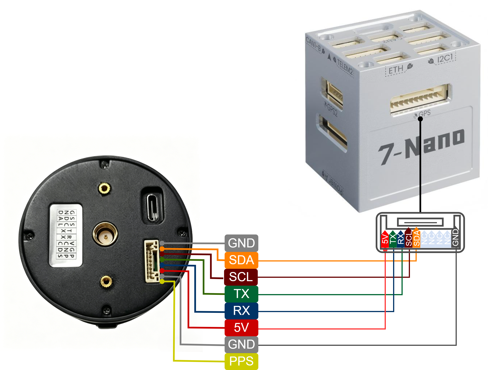
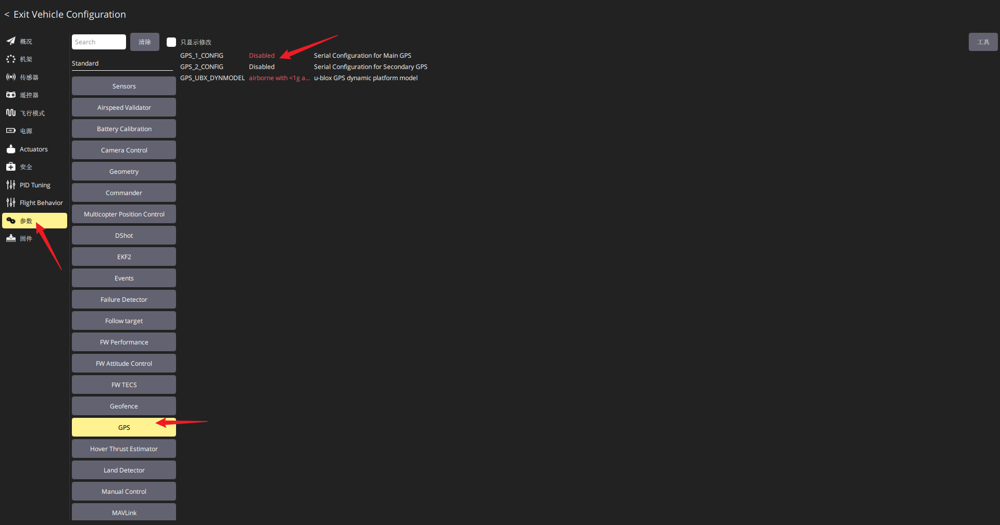
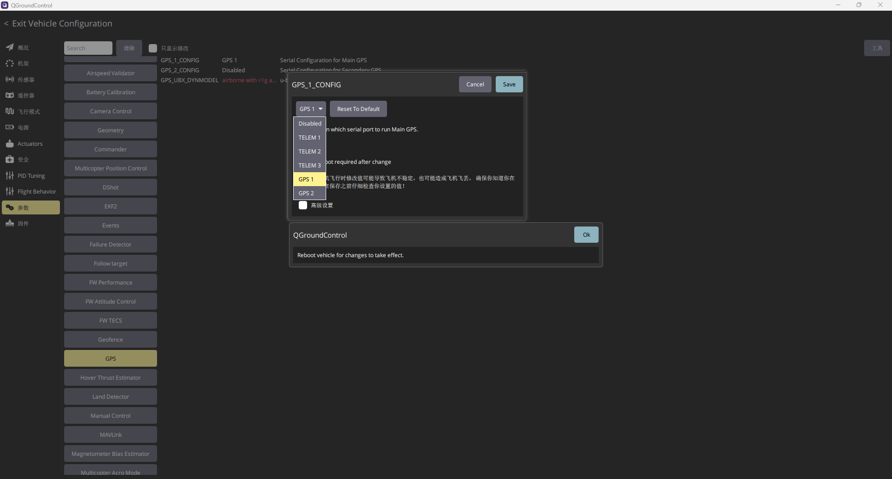
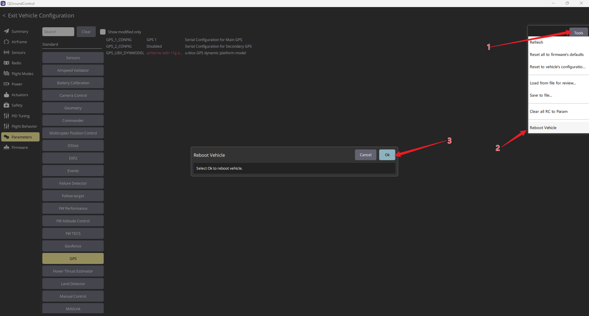
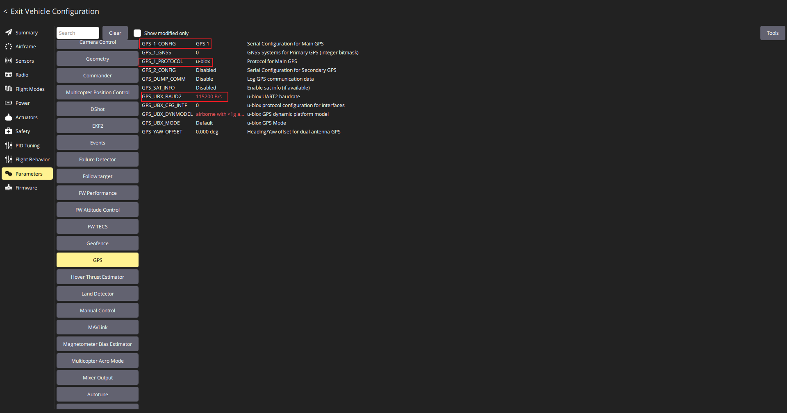
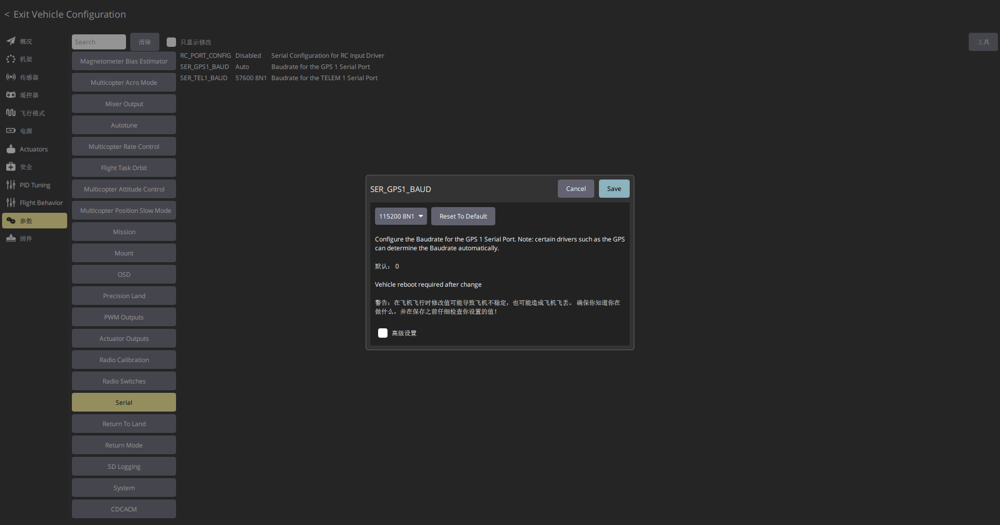
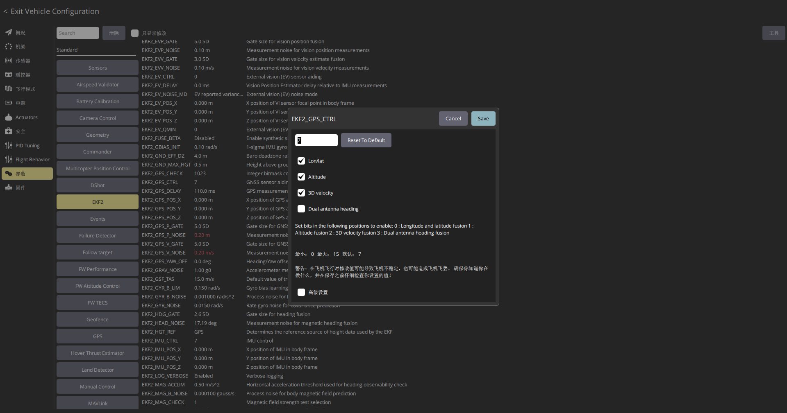

# 无人机应用 - PX4

:::{admonition} 本页目标
:class: page-summary

将 **D20** 接入 PX4，并通过 QGroundControl 验证定位输出。常规使用无人机版固件，通过 GPS 串口默认输出 **10 Hz UBX** 定位数据。
:::

根据现场条件选择 4G 或 LoRa 差分链路。固件选择见[固件与输出协议选择](../operation/firmware-output.md)，完整 Pin 定义见[D20 接口与接线](../operation/d20-wiring.md)。

## 硬件连接

:::{danger} 先核对 D20 8-pin 线束，再连接飞控电源
保持设备和飞控断电，并按[完整 8-pin 定义](../operation/d20-wiring.md)逐线核对。D20 供电为 5 V ±0.5 V，UART/PPS I/O 为 3.3 V；反接电源或把 5 V 接入信号线可能损坏设备。
:::

1. D20 5V接 PX4飞控GPS接口 5V。
2. D20 TX 接 PX4飞控GPS接口 RX。
3. D20 RX 接 PX4飞控GPS接口 TX。
4. D20 GND 接 PX4飞控GPS接口 GND。

下图以PX4固件的CUAV 7-Nano的GPS1接口的接线为例：

若飞控提供明确 Pin 定义的标准 6-pin GPS/UART 接口，可以使用配套的 D20 8-pin 转飞控 6-pin 转接线。连接前必须同时核对转接线两端 Pin 顺序、D20 8-pin 定义和飞控接口定义；接口外形匹配不代表线序一定匹配。

## 参数配置

以下参数用于说明常见 PX4 配置项。不同 PX4 版本和飞控硬件可能采用不同参数名称或端口编号，应以实际固件和 QGroundControl 显示为准。

| 参数名 | 作用 | 建议值 |
| --- | --- | --- |
| `GPS_1_CONFIG` | 使能GPS1 | `GPS1` |
| `GPS_1_PROTOCOL` | 设置 GPS 协议 | `1`（UBX） |
| `GPS_UBX_BAUD2` | 设置GPS UBX协议波特率,D20默认波特率是`115200`,应与`SER_GPS1_BAUD`的波特率配置保持一致 | `115200` |
| `SER_GPS1_BAUD` | 设置串口波特率 | `115200` |
| `EKF2_GPS_CTRL` | 设置 GPS 融合方式 | 保持默认值：`7` |
| `EKF2_GPS_POS_X/Y/Z` | 设置天线相对机体的安装偏移，一般情况也可保持默认没有偏移 | 实测值 |

QGroundControl 中找到GPS的配置并使能GPS1：

设置成GPS1之后QGroundControl 会提示需要重启生效，按如下步骤执行一次飞控重启：

飞控完成重启之后重新进入到`Vehicle Configuration`的`Parameters`参数列表中，找到GPS相关的配置这里就有完整的飞控GPS的配置了，D20想要正确接入飞控按照以下的配置来填写，主要的配置涉及`GPS`、`EKF2`、`Serial`:

`EKF2_GPS_CTRL`飞控一般就是默认值`7`,检查一下参数即可

完成以上步骤之后需要再次重启飞控确保配置生效。

## 验证

在 QGroundControl 中观察 GPS 状态：

- PX4 持续识别 GPS，卫星数和定位数据正常更新。
- HDOP/VDOP 无异常。
- 开阔环境进入 RTK 固定解。

:::{admonition} 接入完成判据
:class: success-check

PX4 持续识别 GPS，并在开阔环境进入 **RTK 固定解**。
:::

若 PX4 无法识别 D20，请先确认 D20 当前为无人机版固件，再检查飞控串口参数、UART 电平兼容性和 TX/RX 接线，并在 QGroundControl 中观察 GPS 状态。

有定位输出但无法进入固定解时，按[RTK 状态与固定解验证](../operation/rtk-fixed-validation.md)检查差分配置和现场条件。
