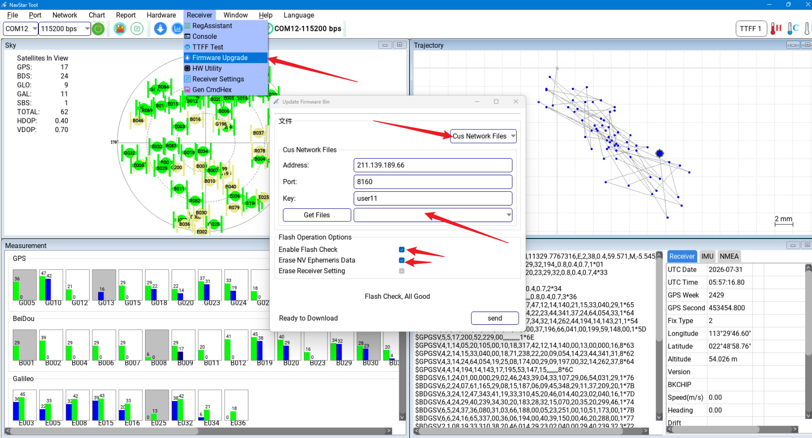
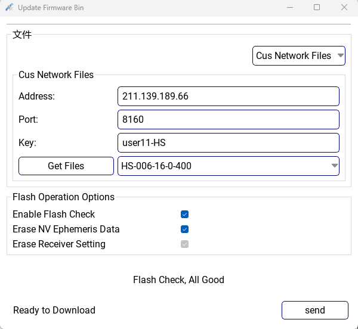

# 固件升级

:::{admonition} 本页目标
:class: page-summary

使用{ref}`NavStarTool <connect-navstartool>`为 **D20 或 D13** 升级固件。尚未安装时可[下载 NavStarTool](https://github.com/myrobotproject/RTK_Interface-Description/blob/main/NavStarTool_260703_cust_En.zip)。升级前先确认目标硬件、使用平台和所需输出协议。
:::

:::{warning} 升级期间保持连接和供电
升级过程中必须保持 **5 V ±0.5 V 供电稳定**，不要拔出串口、移动线缆或关闭上位机。中断写入可能导致设备无法正常启动。
:::

## 升级步骤

点击菜单栏：

```text
Receiver -> Firmware Upgrade
```

在弹出的窗口中选择 `Cus Network Files`，填写升级渠道信息，并设置公开升级渠道 key：

```text
user11-HS
```

选择正确固件后，点击 `Send` 开始写入固件。





## 注意事项

- 升级前确认固件版本适用于当前 D20 或 D13 硬件版本。
- 升级过程中保持 5 V ±0.5 V 供电稳定。
- 不要在升级过程中移动线缆、断开串口或关闭上位机。
- 升级完成后重新连接设备，确认卫星信息和协议输出正常；RTK 产品还应在开阔环境确认能够进入固定解。

:::{admonition} 升级完成判据
:class: success-check

设备能够正常重启，卫星信息和目标协议持续输出；RTK 产品在开阔环境能够重新进入固定解。
:::

固件用途和默认输出见[固件与输出协议选择](../operation/firmware-output.md)。
