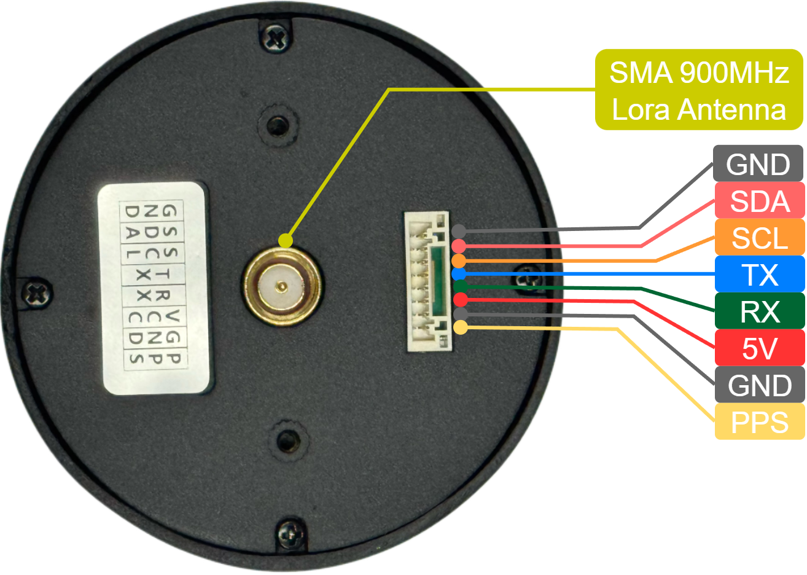
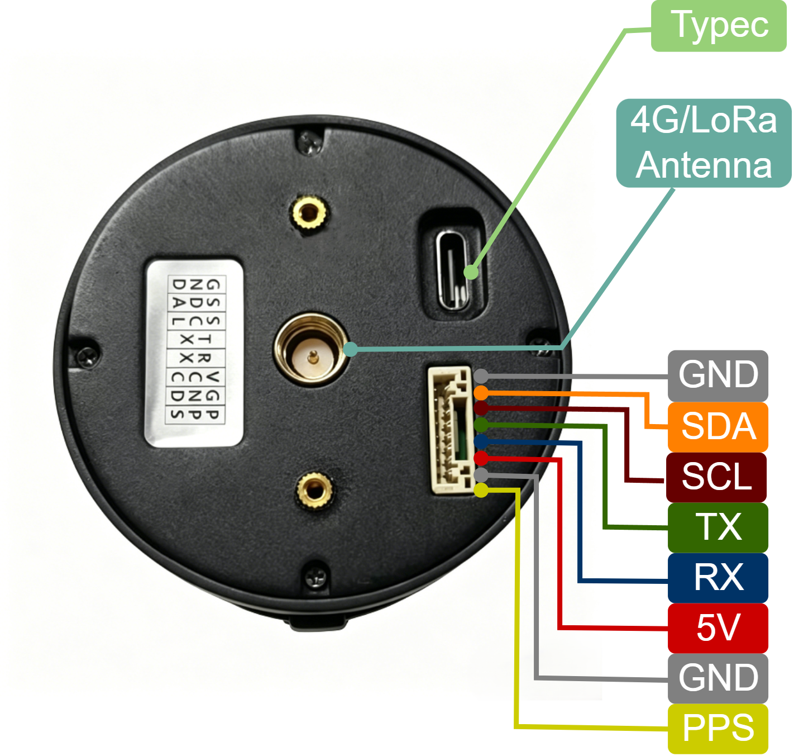

# 产品矩阵

本页用于集中说明各产品系列、产品定位、主要特性、适用场景和文档入口。

| 项目 | D20 | D13 | G51B |
| --- | --- | --- | --- |
| 产品图片 |  |  |  |
| 产品系列 | RTK系列 | RTK系列 | GNSS系列 |
| 产品形态 | 四臂螺旋天线 RTK 一体化定位模组，集成双频多系统 GNSS RTK、四臂螺旋天线和工业级磁罗盘；8Pin GH1.25 接口，尺寸 Φ44 x 37 mm，约 20 g | 蘑菇头天线 RTK 一体化定位模组，集成多频多系统 GNSS RTK、高性能多频 GNSS 天线和 LoRa 通信模块；可作为基站或移动站，尺寸 Φ152 x 67.9 mm，重量 <550 g | 高灵敏度、低功耗单频 GNSS 定位模组，模组尺寸 26.5 x 35.5 x 7.1 mm，配套天线尺寸 25 x 25 x 4 mm |
| 核心定位 | 面向无人系统的双频多系统厘米级 RTK 定位，提供高精度定位、航向和自主导航控制能力 | 面向固定区域基站或移动站应用的厘米级 RTK 定位，支持多终端协同定位所需的一对一、一对多差分数据传输 | 面向紧凑型设备的单频 GNSS 定位，适合低功耗、易集成的 OEM 定位应用 |
| 差分链路 | 4G 版本通过蜂窝网络接入 CORS/NTRIP 差分服务；LoRa 版本通过 D13 基站接收本地差分数据，移动站侧自动完成差分数据注入和 RTK 解算 | 集成 LoRa 数据链路，支持一对一和一对多差分数据传输，通信距离可达约 6 公里；规格书中标注可选 4G 电台模块 | 不配置 RTK 差分链路，支持 AGPS 辅助定位 |
| 协议/固件 | 支持 NMEA0183、NAV-PVT 和 RTCM3；无人机版主要面向飞控 NAV-PVT/u-blox 接入，地面版主要输出 NMEA | TTL 电平串口，默认 115200 bps；输出 NMEA-0183，支持 GGA、RMC、VTG、GSA、GSV，差分数据为 RTCM V3.x | TTL 电平 UART 接口，默认 PVT 协议，默认波特率 115200 bps |
| 典型能力 | 支持 GPS L1/L5、北斗 B1/B2A/B2I/B1C、Galileo E1/E5、QZSS L1/L5、GLONASS G1、IRNSS L5 和 SBAS；200 跟踪通道；RTK 水平精度 0.01 m + 1 ppm，RTK 更新率最高 10 Hz，典型初始化时间 <10 s | 支持 GPS L1/L5、北斗 B1/B2A/B2I、Galileo E1/E5、QZSS L1/L5、GLONASS G1、IRNSS L5；200 跟踪通道；RTK 水平精度 0.01 m + 1 ppm，更新频率 ≤20 Hz，典型初始化时间 <5 s | 支持 GPS L1、北斗 B1、Galileo E1、QZSS L1、GLONASS G1；120 跟踪通道；最高 20 Hz 更新率；定位精度 1.5 m CEP |
| 适用场景 | 无人机高精度定位、精准农业、智能驾驶、车载高精度导航，也可接入飞控、机器人主控、Viobot2 或 PC 上位机 | 大地/航道测绘、精准农业、智能驾驶、海洋测量，以及固定区域内自建基站、多移动站协同作业 | 车载 GNSS 导航、车队管理、资产追踪、AVL/LBS、无人机定位与导航、紧凑型定位终端 |
| 文档入口 | [D20系列介绍](../RTK系列/03-D20系列/01-D20系列介绍.md) | [D13基站系统介绍](../RTK系列/04-D13系列/01-D13基站系统介绍.md) | [G51B](../GNSS系列/G51B/index.rst) |
| 购买链接| 黑森矩阵淘宝店铺 | 黑森矩阵淘宝店铺 | 黑森矩阵淘宝店铺 |

## 产品图片
| | | |
| ---| ---| --- |
|D20 |  |  |

## 软件与资料

**软件工具**

| 名称 | 用途 | 链接 |
| --- | --- | --- |
| NavStarTool | 上位机软件，可用于调试、状态查看、参数配置 | [NavStarTool](https://github.com/myrobotproject/RTK_Interface-Description/blob/main/NavStarTool_260703_cust_En.zip) |
| JR_NTRIP_Config_Tool_V1.2 | D20 4G 版本 CORS/NTRIP 账号配置工具 | [JR_NTRIP_Config_Tool](https://github.com/myrobotproject/RTK_Interface-Description/blob/main/JR_NTRIP_Config_Tool_V1.2_EN.rar) |
| HM_RTK_driver | Hessian Matrix RTK ROS 驱动源码，用于将 RTK NMEA 数据接入 Viobot2 或 ROS 系统 | [HM_RTK_driver](https://github.com/Hessian-matrix/HM_RTK_driver) |

**配置和说明文档**

| 名称 | 用途 | 链接 |
| --- | --- | --- |
| RTK Interface Description | RTK 接口说明、NavStarTool 相关配置资料 | [RTK Interface Description](https://github.com/myrobotproject/RTK_Interface-Description) |
| GNSS_NavStarTool User Guide | NavStarTool 功能说明和操作指导 | [GNSS_NavStarTool User Guide](https://github.com/myrobotproject/RTK_Interface-Description/blob/main/GNSS_NavStarTool%20User%20Guide%20en.pdf) |
