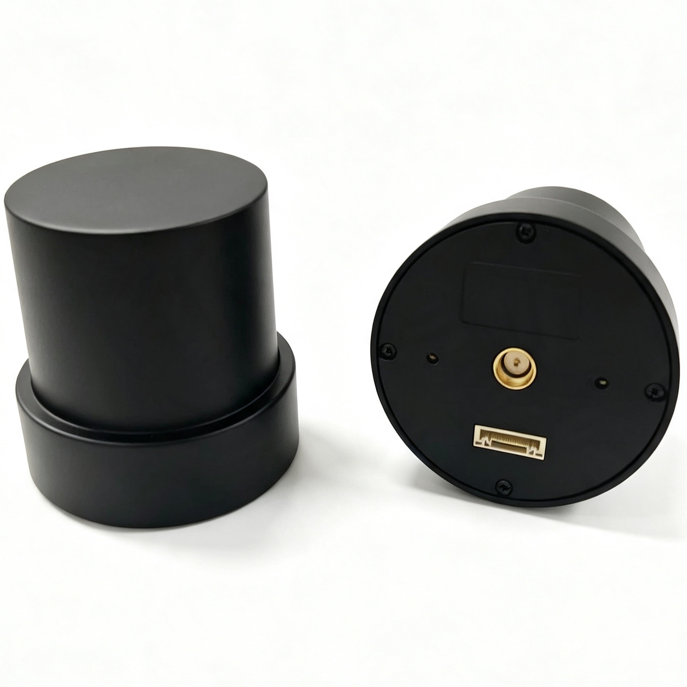
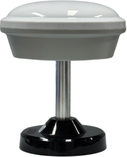
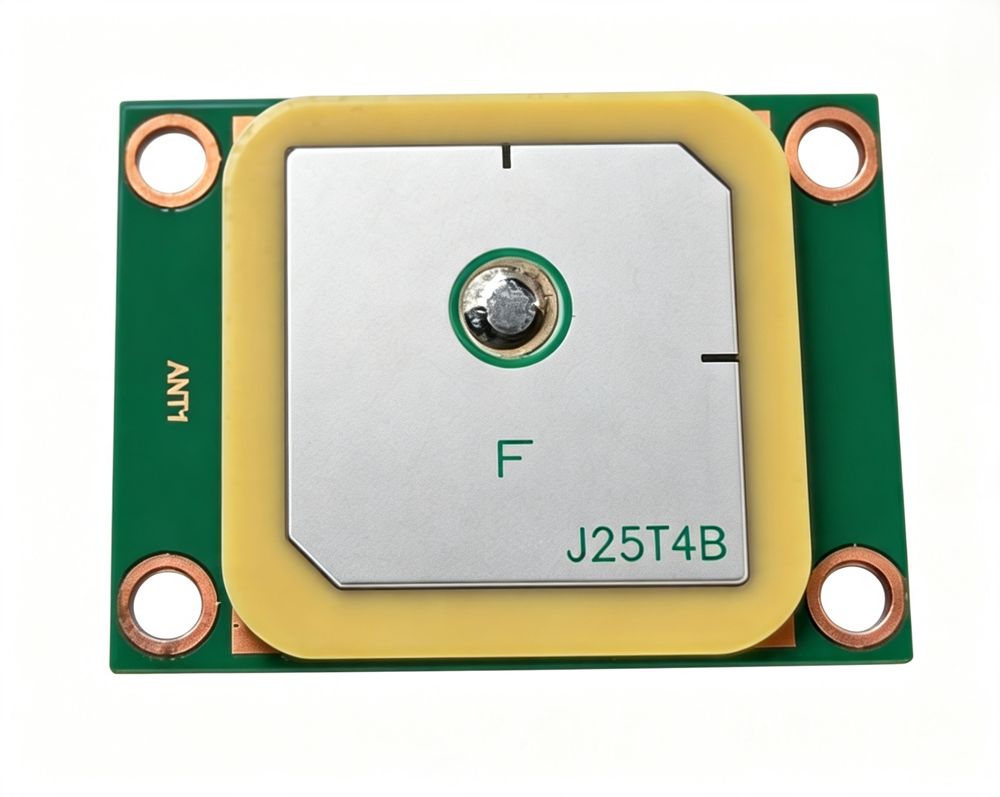

# 产品对比与资料

本页是完整公开参数对比和资料下载入口。产品形态、通信链路和快速选型逻辑请先查看[产品选型](index.rst)；
首次使用和具体操作步骤由对应用户手册维护，本页不重复展开。

## 产品参数对比

表中的“—”表示该参数不适用于对应产品，不表示数据缺失。HM-D20-LoRa 和 HM-D13-LoRa 均为包含 D13 LoRa 基站及配件的套件，基站不单独销售。

| 项目 | HM-D20 系列 | HM-D13 系列 | HM-G51B |
| --- | --- | --- | --- |
| **基本信息** |  |  |  |
| 产品型号 | HM-D20-4G HM-D20-LoRa | HM-D13-4G HM-D13-LoRa | HM-G51B |
| 产品形态 | 四臂螺旋天线 双频 RTK 一体机 | 蘑菇头天线 双频 RTK 一体机 | 单频 GNSS 一体化模组 |
| 工作角色 | 4G/LoRa 移动站 | 4G/LoRa 移动站 LoRa 套件含专用 D13 LoRa 基站 | 普通 GNSS 定位 |
| 主接口 | 8-pin GH1.25 mm | 移动站：5-pin 航空接口 专用基站：2-pin USB 供电 | UART / UBX-NAV-PVT |
| 尺寸 | Φ54.5 × 53 mm | Φ152 × 67.9 mm 移动站与配套基站相同 | 26.5 × 35.5 × 7.1 mm |
| 重量 | 4G：38.2 g LoRa 移动站：38.2 g | 4G：255 g LoRa 移动站：236 g LoRa 基站：515 g | 10 g |
| **GNSS 特性** |  |  |  |
| 定位类型 | L1/L5 双频 RTK | L1/L5 双频 RTK | L1 单频 GNSS |
| 接收频点 | GPS：L1/L5 北斗：B1/B2A/B2I Galileo：E1/E5 QZSS：L1/L5 GLONASS：G1 IRNSS：L5 支持 SBAS | GPS：L1/L5 北斗：B1/B2A/B2I Galileo：E1/E5 QZSS：L1/L5 GLONASS：G1 IRNSS：L5 支持 SBAS | GPS：L1 北斗：B1 Galileo：E1 QZSS：L1 GLONASS：G1 |
| 天线增益 | 40 dB | 40 dB | — |
| 跟踪通道 | 200 | 200 | 120 |
| G51B GNSS 定位精度 | — | — | 1.5 m CEP |
| RTK 精度 | 水平：1.0 cm + 1 ppm 垂直：1.5 cm + 1 ppm | 水平：1.0 cm + 1 ppm 垂直：1.5 cm + 1 ppm | — |
| 速度精度 | 0.05 m/s | 0.05 m/s | 0.05 m/s |
| 捕获 / 跟踪灵敏度 | -148 / -163 dBm | -148 / -163 dBm | -148 / -163 dBm |
| 1PPS 时间精度 | 20 ns | 20 ns | 20 ns |
| 冷启动时间 | 28 s | 28 s | 28 s |
| 热启动时间 | 1 s | 1 s | 1 s |
| RTK 首次固定 | 45 s | 45 s | — |
| 最高更新率 | 20 Hz | 20 Hz | 20 Hz |
| 默认输出 | 地面版：10 Hz NMEA 无人机版：10 Hz UBX | 地面版：10 Hz NMEA | UBX-NAV-PVT，默认 115200 bps |
| **差分与通信** |  |  |  |
| 4G 链路 | CORS/NTRIP Nano-SIM 外置 SMA 4G 天线 外部 USB-C 配置口 | CORS/NTRIP Nano-SIM 内置 4G 天线 USB-C 配置口位于顶壳内部 | — |
| LTE 频段 | B1/B2/B3/B4/B5/B7/B8/B12/B18/B19/B20/B26/B28/B38/B40/B41/B66 | 同左 | — |
| LoRa 工作频率 | 默认 915 MHz | 默认 915 MHz | — |
| LoRa 套件 | D20 移动站 + 专用 D13 LoRa 基站及配件 | D13 移动站 + 专用 D13 LoRa 基站及配件 | — |
| LoRa 拓扑 | 单基站 一对一 / 一对多 最多 4096 个移动站 | 同左 | — |
| LoRa 距离 | 最远约 6 km | 同左 | — |
| **接口与协议** |  |  |  |
| RTK 设备 UART IO 电平 | 3.3 V | 3.3 V | — |
| 默认波特率 | 115200 bps | 115200 bps | 115200 bps |
| 对外输出协议 | NMEA 或 UBX 按订单用途配置 D20 固件 | NMEA | UBX-NAV-PVT |
| 磁力计 | QMC5883L SCL/SDA 接口 标准校准 | — | — |
| **电气与环境** |  |  |  |
| 工作电压 | 5 V ±0.5 V 4.5–5.5 V | 5 V ±0.5 V 4.5–5.5 V | 4.0–5.5 V 典型 5 V |
| 工作电流 | 4G：典型 120 mA LoRa：典型 80 mA | — | @ 5 V 最小 25 mA 典型 28 mA 最大 30 mA |
| 工作温度 | -40–85 °C | -40–85 °C | -40–85 °C |
| 存储温度 | -50–105 °C | -50–105 °C | -50–105 °C |
| RTK 动态条件 | 高度：50,000 m 速度：500 m/s 加速度：≤4 g | 同左 | — |
| **应用与资料** |  |  |  |
| 典型场景 | 无人机 精准农业 智能驾驶 车载导航 机器人 / Viobot2 / PC | 测绘 精准农业 智能驾驶 固定区域作业 自建基站 / 多移动站 | 车载导航 车队管理 资产追踪 / AVL/LBS 无人机 紧凑终端 |
| 文档入口 | [HM-D20-4G](产品/HM-D20-4G.md) [HM-D20-LoRa](产品/HM-D20-LoRa.md) | [HM-D13-4G](产品/HM-D13-4G.md) [HM-D13-LoRa](产品/HM-D13-LoRa.md) | [HM-G51B](产品/HM-G51B.md) |
| 购买链接 | 黑森矩阵淘宝店铺 | 黑森矩阵淘宝店铺 | 黑森矩阵淘宝店铺 |

## 产品图片

| HM-D20 | HM-D13 | HM-G51B |
| --- | --- | --- |
|  |  |  |

## 软件与资料

**软件工具**

| 名称 | 用途 | 链接 |
| --- | --- | --- |
| NavStarTool | 上位机软件，可用于调试、状态查看、参数配置 | [NavStarTool](https://github.com/myrobotproject/RTK_Interface-Description/blob/main/NavStarTool_260703_cust_En.zip) |
| JR_NTRIP_Config_Tool_V1.2 | HM-D20-4G、HM-D13-4G 的 CORS/NTRIP 配置工具 | [JR_NTRIP_Config_Tool](https://github.com/myrobotproject/RTK_Interface-Description/blob/main/JR_NTRIP_Config_Tool_V1.2_EN.rar) |
| D20_ros_driver | D20/D13 ROS1/ROS2 驱动，解析 NMEA 或 UBX 并发布 `NavSatFix` 与原始 NMEA 话题 | [D20_ros_driver](https://github.com/Hessian-matrix/D20_ros_driver) |

**配置和说明文档**

| 名称 | 用途 | 链接 |
| --- | --- | --- |
| RTK Interface Description | RTK 接口说明、NavStarTool 相关配置资料 | [RTK Interface Description](https://github.com/myrobotproject/RTK_Interface-Description) |
| GNSS_NavStarTool User Guide | NavStarTool 功能说明和操作指导 | [GNSS_NavStarTool User Guide](https://github.com/myrobotproject/RTK_Interface-Description/blob/main/GNSS_NavStarTool%20User%20Guide%20en.pdf) |
